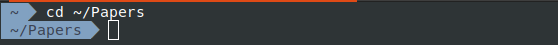
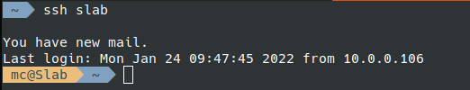
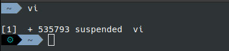

ZSH-Theme-Zest
==============
A simple, functional theme for ZSH.

Influenced by [zsh2000](https://github.com/consolemaverick/zsh2000), [agnoster's theme](https://gist.github.com/3712874) and [jeremyFreeAgent's theme](https://github.com/jeremyFreeAgent/oh-my-zsh-powerline-theme).


Previews
--------

Simple path displays relative to the `$HOME` directory:




Display the remote login, if present:




Icon to show suspended tasks:




Installation
============

1. Install your preferred version of the [Powerline-patched fonts](https://github.com/Lokaltog/powerline-fonts)

2. Install within Oh-My-ZSH:

```
cd ~/.oh-my-zsh/custom/themes
git clone https://github.com/hash-bang/zsh-theme-zest.git
ln -s zsh-theme-zest/zest.zsh-theme .
```

3. Set the theme option within your ZSH config:

```
ZSH_THEME="zest"

# Add config options here if you have any (see below)
```


Options
=======
Set any of the `ZSH_THEME_*` options to customize the theme:

| Segment  | Option                                     | Default              | Description                                                                                                           |
|----------|--------------------------------------------|----------------------|-----------------------------------------------------------------------------------------------------------------------|
| Status   | `ZSH_THEME_STATUS_ENABLE`                  | `"1"`                | Whether to enable the status segment (show the status of the last command + wheteher the user is root + pending jobs) |
|          | `ZSH_THEME_STATUS_COLOR_BG`                | `"black"`            | Background color of the status segment                                                                                |
|          | `ZSH_THEME_STATUS_COLOR_RETVAL_NONZERO_FG` | `"yellow"`           | Non-zero return forground color of the previous command                                                               |
|          | `ZSH_THEME_STATUS_COLOR_ROOT_FG`           | `"yellow"`           | "User is root" foreground indicator color                                                                             |
|          | `ZSH_THEME_STATUS_COLOR_JOBS_FG`           | `"cyan"`             | "There are background jobs" foreground indicator color                                                                |
| Hostname | `ZSH_THEME_HOSTNAME_ENABLE`                | `"2"`                | Enable hostname segment: 0 - disable, 1 - always enable, 2 - only if the dialed into another server via SSH           |
|          | `ZSH_THEME_HOSTNAME_COLOR_BG`              | `"#ECBE7B"`          | Hostname segment foreground color                                                                                     |
|          | `ZSH_THEME_HOSTNAME_COLOR_FG`              | `"#3B4252"`          | Hostname segment background color                                                                                     |
| Path     | `ZSH_THEME_PATH_FORMAT`                    | `"%~"`               | How to display paths, '%1d' - current directory only, '%d' - full path, '%~' - Shortened home full path               |
|          | `ZSH_THEME_PATH_COLOR_BG`                  | `"#81A1C1"`          | Path segment background color                                                                                         |
|          | `ZSH_THEME_PATH_COLOR_FG`                  | `"#3B4252"`          | Path segment foreground color                                                                                         |
| Git      | `ZSH_THEME_GIT_COLOR_BG`                   | `"#434C5E"`          | Git segment background color                                                                                          |
|          | `ZSH_THEME_GIT_COLOR_FG`                   | `"#D8DEE9"`          | Git segment foreground color                                                                                          |
|          | `ZSH_THEME_GIT_REWRITE_REPLACE_ENABLE`     | `"1"`                | Enable rewriting branches                                                                                             |
|          | `ZSH_THEME_GIT_REWRITE_REPLACE_BRANCHES`   | `("master", "main")` | Which branch names to rewrite                                                                                         |
|          | `ZSH_THEME_GIT_REWRITE_REPLACE_DIRTY`      | `"🞱"`                | Rewrite "master" branches with this symbol if the branch is dirty                                                     |
|          | `ZSH_THEME_GIT_REWRITE_REPLACE_NONDIRTY`   | `"●"`                | Rewrite "master" branches with this symbol if the branch is non-dirty                                                 |
|          | `ZSH_THEME_GIT_SYMBOLS_ENABLE`             | `"0"`                | Use the standard Oh-My-ZSH `git_prompt_status` helper to render Git status symbols                                    |


**Notes**:
* All `ZSH_THEME_*_COLOR_{BG,FG}` values can be either a valid ANSI color (e.g. `black`, `yellow`, `gray`), a [256 integter color code](https://michurin.github.io/xterm256-color-picker/) (e.g. `33`, `19`) or a Hex code (e.g. `#434C5E`, `#ECBE7B`)
* `ZSH_THEME_PATH_FORMAT` follows the ZSH formatting standard, see the man page for zsh for more details on possible values and their documentation
